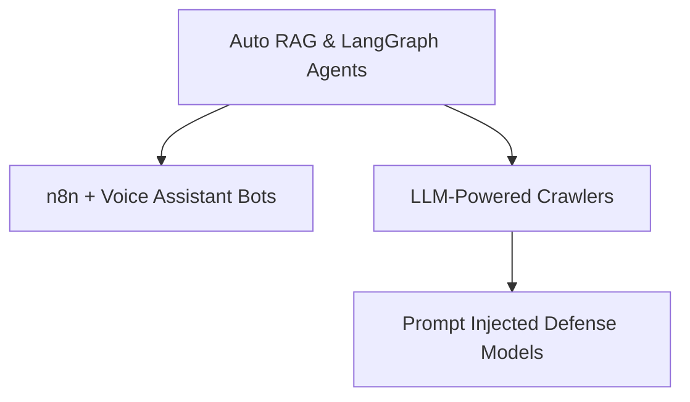

# 🚀 COSMIC TECH EXPLORER README
### **AI Architect • Full-Stack Visionary • Cybernetic Defender**

<div align="center">
  
</div>

---

## 👁️‍🗨️ Console Identity
```python
class CosmicTech:
    def __init__(self):
        self.alias = "Full-Stack Developer | ML Engineer | Hacker"
        self.zone = "Nagarkurnool, India"
        self.learning = "Engineering @ Samskruti College"
        self.arsenal = [
            "Autonomous AI Systems",
            "Backend Infrastructures",
            "Advanced Cybersecurity",
            "Agentic Workflows"
        ]

    def quest(self):
        return "Architecting ethical and scalable technologies for next-gen intelligence"
```

---

## ⚙️ STACK OVERLOAD

### 🎯 AI / ML Warriors


▸ LLMs (DeepSeek, Mistral) ▸ Whisper ▸ RAG Pipelines ▸ Diffusion Models

### 🕸 Full-Stack Universe


▸ REST APIs ▸ LangChain Frontends ▸ Realtime Systems

### 🛡 Offensive Arsenal


▸ Bug Bounties ▸ SQLi ▸ XSS ▸ Reverse Shell

### 🔁 Automation Infrastructure


▸ WhatsApp Bots ▸ LLM Agents ▸ Zapier-style triggers

---

## 🧮 DATA SNAPSHOT

```yaml
Contributions: "10,000+"
Hackathons: "Won 5+ | Participated 15+"
Certifications:
  - ISRO AI/ML
  - Tata Consultancy Problem Solving
  - Microsoft / Google Cloud / AWS
```

<p align="center">
  
</p>

---

## 🧠 FEATURED TECH INITIATIVES

### 🔭 LunaGuard (ISRO Hackathon Winner)
> Chandrayaan Data Processor | Moon Landslide AI Detection | Satellite Vision Modeling

### 🗣 Omnix
> Multimodal AI Assistant | Whisper + LLM + Gradio UI | Real-time Transcription to Visuals

### 🔐 ShadowPulse
> Blockchain-based Fund Flow | Smart Contract Validator | Transparency Tech for Governance

---

## 🛸 ACTIVE QUESTS


---

## 🌐 CONNECT WITH SIDDU'S NETWORK
[](https://linkedin.com/in/yourprofile)
[](https://twitter.com/yourhandle)
[](mailto:your@email.com)
[](https://yourdomain.com)

---

## 🎯 BELIEF
> "You don’t just write code—you architect futures."

<p align="center">
  
</p>
****
