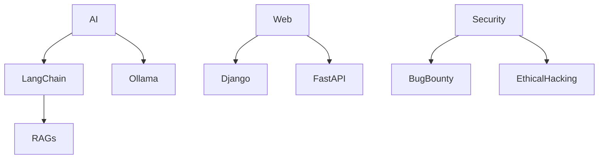

<h1 align="center">Hi, I'm Cosmic Hackers 👋</h1>

  

## 👨‍💻 About Me

I'm a **Cybernetic Technologist** passionate about merging AI, automation, and security into powerful systems. I love building tools, solving real-world problems, and contributing to open-source.  
Currently exploring:

- 🤖 Generative AI (Ollama, LangChain, RAGs)
- 💻 Full-stack web with Django, FastAPI, JS/TS
- 🔐 Ethical hacking & Bug Bounty
- ⚙️ Automation tools like n8n + CI/CD pipelines

> 🧠 "Code doesn't just solve — it **evolves**."

## ⚙️ Tech Stack

**AI/ML**  

**Web Development**  

**DevOps & Tools**  

**Cybersecurity**  

## 🚀 Featured Projects

| Project | Tech | Description |
|--------|------|-------------|
| [LunaGuard](https://github.com/Cosmic-hacers/LunaGuard) | AI, CV | Detect lunar landslides using ISRO's Chandrayaan data |
| [Omnix](https://github.com/Cosmic-hacers/Omnix) | Whisper, LLM | Voice assistant with real-time AI chat |
| [ShadowPulse](https://github.com/Cosmic-hacers/ShadowPulse) | Blockchain | Transparent public fund distribution via smart contracts |

## 📊 GitHub Analytics

  
  

  

## 🏆 Certifications & Awards

- 🥇 Winner: Google Solution Challenge
- 🥇 NESSO GenAI Hackathon Champion
- 📜 ISRO - Certified in AI/ML (Satellite Data)
- 🎓 Microsoft & AWS Cloud Certified

## 🔗 Let's Connect

## 🧭 Learning Path

  

---

  <b>⭐ From [Cosmic-hacers](https://github.com/Cosmic-hacers)</b>

