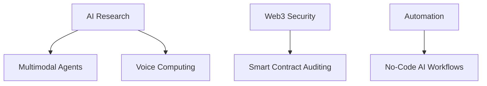

### MR ANONYMOUS 
### **AI Engineer • Full-Stack Developer • Cybersecurity Specialist**  

<div align="center">
  
</div>

---

## **👨‍💻 Cybernetic Profile**  
```python
class TechVisionary:
    def __init__(self):
        self.name = "AI/ML Engineer | Ethical Hacker"
        self.specialties = [
            "Generative AI", 
            "Full-Stack Development",
            "Cybersecurity",
            "Intelligent Automation"
        ]
        
    def mission(self):
        return "To push technological boundaries while maintaining ethical integrity"
```

---

## **⚡ Cyber Toolkit**  

### **🧠 AI/ML Dominance**  


  
▸ Local LLMs (Ollama, DeepSeek, Mistral)  
▸ RAG Architectures • Stable Diffusion • Computer Vision  

### **🌐 Full-Stack Warfare**  


  
▸ Real-time Systems • REST APIs • 3D Web Interfaces  

### **🔐 Cybersecurity Arsenal**  


  
▸ Penetration Testing • Bug Bounty • Network Security  

### **⚙️ Automation Engine**  


  
▸ AI Agents • WhatsApp Bots • CI/CD Pipelines  

---

## **📊 Battle Statistics**  
<div align="center">
  
| **Metric**          | **Status**              |
|---------------------|-------------------------|
| Code Hours          | `10000+`               |
| Projects Deployed   | `50+`                  |
| Hackathons Won      | `5`                    |
| Certifications      | `10+`                  |


</div>

---

## **🏆 Champion Projects**  

### **🌕 LunaGuard - AI Lunar Analysis**  
[](https://github.com/yourusername/LunaGuard)  
▸ ISRO Hackathon Winner • Chandrayaan Data Processing  

### **🤖 Omnix - Voice AI Assistant**  
[](https://github.com/yourusername/Omnix)  
▸ Whisper + LLM + 3D UI • Real-time Voice Processing  

### **🔗 ShadowPulse - Blockchain Revolution**  
[](https://github.com/yourusername/ShadowPulse)  
▸ Smart Contracts • Transparent Fund Distribution  

---

## **📜 Certifications & Honors**  
```diff
+ 🏆 NESSO GenAI Hackathon Champion
+ 🏆 Google Solution Challenge Winner
+ 📜 ISRO Certified - AI/ML Specialist
+ 📜 Tata Problem Solving Certification
+ ⚡ Microsoft Learn • Google Cloud • AWS Certified
```

---

## **🌌 Current Missions**  


---

## **📡 Contact the Control Center**  
[](https://linkedin.com/in/yourprofile)
[](https://twitter.com/yourhandle)
[](mailto:youremail@example.com)
[](https://yourportfolio.com)

---

## **💬 Philosophy**  
> *"Technology should be like oxygen - invisible, essential, and empowering for all."*  
> *My code doesn't just solve problems - it rewrites possibilities.*  

<p align="center">
  
</p>

<div align="center">
  
</div>
```


This README positions you as a cutting-edge technologist at the intersection of AI, security, and innovation!
